Mini Data-Analysis Deliverable 1
================

# Welcome to your (maybe) first-ever data analysis project!

And hopefully the first of many. Let’s get started:

1.  Install the [`datateachr`](https://github.com/UBC-MDS/datateachr)
    package by typing the following into your **R terminal**:

<!-- -->

    install.packages("devtools")
    devtools::install_github("UBC-MDS/datateachr")

2.  Load the packages below.

``` r
library(datateachr)
library(tidyverse)
```

    ## Warning: package 'tidyverse' was built under R version 4.1.3

    ## -- Attaching packages --------------------------------------- tidyverse 1.3.2 --
    ## v ggplot2 3.3.6     v purrr   0.3.4
    ## v tibble  3.1.8     v dplyr   1.0.9
    ## v tidyr   1.2.0     v stringr 1.4.1
    ## v readr   2.1.2     v forcats 0.5.2

    ## Warning: package 'ggplot2' was built under R version 4.1.3

    ## Warning: package 'tibble' was built under R version 4.1.3

    ## Warning: package 'tidyr' was built under R version 4.1.3

    ## Warning: package 'dplyr' was built under R version 4.1.3

    ## Warning: package 'stringr' was built under R version 4.1.3

    ## Warning: package 'forcats' was built under R version 4.1.3

    ## -- Conflicts ------------------------------------------ tidyverse_conflicts() --
    ## x dplyr::filter() masks stats::filter()
    ## x dplyr::lag()    masks stats::lag()

3.  Make a repository in the <https://github.com/stat545ubc-2022>
    Organization. You will be working with this repository for the
    entire data analysis project. You can either make it public, or make
    it private and add the TA’s and Lucy as collaborators. A link to
    help you create a private repository is available on the
    \#collaborative-project Slack channel.

# Instructions

## For Both Milestones

-   Each milestone is worth 45 points. The number of points allocated to
    each task will be annotated within each deliverable. Tasks that are
    more challenging will often be allocated more points.

-   10 points will be allocated to the reproducibility, cleanliness, and
    coherence of the overall analysis. While the two milestones will be
    submitted as independent deliverables, the analysis itself is a
    continuum - think of it as two chapters to a story. Each chapter, or
    in this case, portion of your analysis, should be easily followed
    through by someone unfamiliar with the content.
    [Here](https://swcarpentry.github.io/r-novice-inflammation/06-best-practices-R/)
    is a good resource for what constitutes “good code”. Learning good
    coding practices early in your career will save you hassle later on!

## For Milestone 1

**To complete this milestone**, edit [this very `.Rmd`
file](https://raw.githubusercontent.com/UBC-STAT/stat545.stat.ubc.ca/master/content/mini-project/mini-project-1.Rmd)
directly. Fill in the sections that are tagged with
`<!--- start your work below --->`.

**To submit this milestone**, make sure to knit this `.Rmd` file to an
`.md` file by changing the YAML output settings from
`output: html_document` to `output: github_document`. Commit and push
all of your work to the mini-analysis GitHub repository you made
earlier, and tag a release on GitHub. Then, submit a link to your tagged
release on canvas.

**Points**: This milestone is worth 45 points: 43 for your analysis, 1
point for having your Milestone 1 document knit error-free, and 1 point
for tagging your release on Github.

# Learning Objectives

By the end of this milestone, you should:

-   Become familiar with your dataset of choosing
-   Select 4 questions that you would like to answer with your data
-   Generate a reproducible and clear report using R Markdown
-   Become familiar with manipulating and summarizing your data in
    tibbles using `dplyr`, with a research question in mind.

# Task 1: Choose your favorite dataset (10 points)

The `datateachr` package by Hayley Boyce and Jordan Bourak currently
composed of 7 semi-tidy datasets for educational purposes. Here is a
brief description of each dataset:

-   *apt_buildings*: Acquired courtesy of The City of Toronto’s Open
    Data Portal. It currently has 3455 rows and 37 columns.

-   *building_permits*: Acquired courtesy of The City of Vancouver’s
    Open Data Portal. It currently has 20680 rows and 14 columns.

-   *cancer_sample*: Acquired courtesy of UCI Machine Learning
    Repository. It currently has 569 rows and 32 columns.

-   *flow_sample*: Acquired courtesy of The Government of Canada’s
    Historical Hydrometric Database. It currently has 218 rows and 7
    columns.

-   *parking_meters*: Acquired courtesy of The City of Vancouver’s Open
    Data Portal. It currently has 10032 rows and 22 columns.

-   *steam_games*: Acquired courtesy of Kaggle. It currently has 40833
    rows and 21 columns.

-   *vancouver_trees*: Acquired courtesy of The City of Vancouver’s Open
    Data Portal. It currently has 146611 rows and 20 columns.

**Things to keep in mind**

-   We hope that this project will serve as practice for carrying our
    your own *independent* data analysis. Remember to comment your code,
    be explicit about what you are doing, and write notes in this
    markdown document when you feel that context is required. As you
    advance in the project, prompts and hints to do this will be
    diminished - it’ll be up to you!

-   Before choosing a dataset, you should always keep in mind **your
    goal**, or in other ways, *what you wish to achieve with this data*.
    This mini data-analysis project focuses on *data wrangling*,
    *tidying*, and *visualization*. In short, it’s a way for you to get
    your feet wet with exploring data on your own.

And that is exactly the first thing that you will do!

1.1 Out of the 7 datasets available in the `datateachr` package, choose
**4** that appeal to you based on their description. Write your choices
below:

**Note**: We encourage you to use the ones in the `datateachr` package,
but if you have a dataset that you’d really like to use, you can include
it here. But, please check with a member of the teaching team to see
whether the dataset is of appropriate complexity. Also, include a
**brief** description of the dataset here to help the teaching team
understand your data.

<!-------------------------- Start your work below ---------------------------->

1: cancer_sample 2: flow_sample 3: vancouver_trees 4: parking_meters

<!----------------------------------------------------------------------------->

1.2 One way to narrowing down your selection is to *explore* the
datasets. Use your knowledge of dplyr to find out at least *3*
attributes about each of these datasets (an attribute is something such
as number of rows, variables, class type…). The goal here is to have an
idea of *what the data looks like*.

*Hint:* This is one of those times when you should think about the
cleanliness of your analysis. I added a single code chunk for you below,
but do you want to use more than one? Would you like to write more
comments outside of the code chunk?

<!-------------------------- Start your work below ---------------------------->

``` r
### EXPLORE HERE ###
cancer_sample
```

    ## # A tibble: 569 x 32
    ##          ID diagnosis radius_m~1 textu~2 perim~3 area_~4 smoot~5 compa~6 conca~7
    ##       <dbl> <chr>          <dbl>   <dbl>   <dbl>   <dbl>   <dbl>   <dbl>   <dbl>
    ##  1   842302 M               18.0    10.4   123.    1001   0.118   0.278   0.300 
    ##  2   842517 M               20.6    17.8   133.    1326   0.0847  0.0786  0.0869
    ##  3 84300903 M               19.7    21.2   130     1203   0.110   0.160   0.197 
    ##  4 84348301 M               11.4    20.4    77.6    386.  0.142   0.284   0.241 
    ##  5 84358402 M               20.3    14.3   135.    1297   0.100   0.133   0.198 
    ##  6   843786 M               12.4    15.7    82.6    477.  0.128   0.17    0.158 
    ##  7   844359 M               18.2    20.0   120.    1040   0.0946  0.109   0.113 
    ##  8 84458202 M               13.7    20.8    90.2    578.  0.119   0.164   0.0937
    ##  9   844981 M               13      21.8    87.5    520.  0.127   0.193   0.186 
    ## 10 84501001 M               12.5    24.0    84.0    476.  0.119   0.240   0.227 
    ## # ... with 559 more rows, 23 more variables: concave_points_mean <dbl>,
    ## #   symmetry_mean <dbl>, fractal_dimension_mean <dbl>, radius_se <dbl>,
    ## #   texture_se <dbl>, perimeter_se <dbl>, area_se <dbl>, smoothness_se <dbl>,
    ## #   compactness_se <dbl>, concavity_se <dbl>, concave_points_se <dbl>,
    ## #   symmetry_se <dbl>, fractal_dimension_se <dbl>, radius_worst <dbl>,
    ## #   texture_worst <dbl>, perimeter_worst <dbl>, area_worst <dbl>,
    ## #   smoothness_worst <dbl>, compactness_worst <dbl>, concavity_worst <dbl>, ...

``` r
flow_sample
```

    ## # A tibble: 218 x 7
    ##    station_id  year extreme_type month   day  flow sym  
    ##    <chr>      <dbl> <chr>        <dbl> <dbl> <dbl> <chr>
    ##  1 05BB001     1909 maximum          7     7   314 <NA> 
    ##  2 05BB001     1910 maximum          6    12   230 <NA> 
    ##  3 05BB001     1911 maximum          6    14   264 <NA> 
    ##  4 05BB001     1912 maximum          8    25   174 <NA> 
    ##  5 05BB001     1913 maximum          6    11   232 <NA> 
    ##  6 05BB001     1914 maximum          6    18   214 <NA> 
    ##  7 05BB001     1915 maximum          6    27   236 <NA> 
    ##  8 05BB001     1916 maximum          6    20   309 <NA> 
    ##  9 05BB001     1917 maximum          6    17   174 <NA> 
    ## 10 05BB001     1918 maximum          6    15   345 <NA> 
    ## # ... with 208 more rows

``` r
vancouver_trees
```

    ## # A tibble: 146,611 x 20
    ##    tree_id civic_number std_st~1 genus~2 speci~3 culti~4 commo~5 assig~6 root_~7
    ##      <dbl>        <dbl> <chr>    <chr>   <chr>   <chr>   <chr>   <chr>   <chr>  
    ##  1  149556          494 W 58TH ~ ULMUS   AMERIC~ BRANDON BRANDO~ N       N      
    ##  2  149563          450 W 58TH ~ ZELKOVA SERRATA <NA>    JAPANE~ N       N      
    ##  3  149579         4994 WINDSOR~ STYRAX  JAPONI~ <NA>    JAPANE~ N       N      
    ##  4  149590          858 E 39TH ~ FRAXIN~ AMERIC~ AUTUMN~ AUTUMN~ Y       N      
    ##  5  149604         5032 WINDSOR~ ACER    CAMPES~ <NA>    HEDGE ~ N       N      
    ##  6  149616          585 W 61ST ~ PYRUS   CALLER~ CHANTI~ CHANTI~ N       N      
    ##  7  149617         4909 SHERBRO~ ACER    PLATAN~ COLUMN~ COLUMN~ N       N      
    ##  8  149618         4925 SHERBRO~ ACER    PLATAN~ COLUMN~ COLUMN~ N       N      
    ##  9  149619         4969 SHERBRO~ ACER    PLATAN~ COLUMN~ COLUMN~ N       N      
    ## 10  149625          720 E 39TH ~ FRAXIN~ AMERIC~ AUTUMN~ AUTUMN~ N       N      
    ## # ... with 146,601 more rows, 11 more variables: plant_area <chr>,
    ## #   on_street_block <dbl>, on_street <chr>, neighbourhood_name <chr>,
    ## #   street_side_name <chr>, height_range_id <dbl>, diameter <dbl>, curb <chr>,
    ## #   date_planted <date>, longitude <dbl>, latitude <dbl>, and abbreviated
    ## #   variable names 1: std_street, 2: genus_name, 3: species_name,
    ## #   4: cultivar_name, 5: common_name, 6: assigned, 7: root_barrier

``` r
parking_meters
```

    ## # A tibble: 10,032 x 22
    ##    meter_head  r_mf_9a~1 r_mf_~2 r_sa_~3 r_sa_~4 r_su_~5 r_su_~6 rate_~7 time_~8
    ##    <chr>       <chr>     <chr>   <chr>   <chr>   <chr>   <chr>   <chr>   <chr>  
    ##  1 Twin        $2.00     $4.00   $2.00   $4.00   $2.00   $4.00   <NA>    METER ~
    ##  2 Pay Station $1.00     $1.00   $1.00   $1.00   $1.00   $1.00   $ .50   METER ~
    ##  3 Twin        $1.00     $1.00   $1.00   $1.00   $1.00   $1.00   <NA>    METER ~
    ##  4 Single      $1.00     $1.00   $1.00   $1.00   $1.00   $1.00   <NA>    METER ~
    ##  5 Twin        $2.00     $1.00   $2.00   $1.00   $2.00   $1.00   <NA>    METER ~
    ##  6 Twin        $2.00     $1.00   $2.00   $1.00   $2.00   $1.00   <NA>    METER ~
    ##  7 Twin        $2.00     $3.00   $2.00   $3.00   $2.00   $3.00   <NA>    METER ~
    ##  8 Single      $2.00     $3.00   $2.00   $3.00   $2.00   $3.00   <NA>    METER ~
    ##  9 Twin        $4.00     $1.00   $4.00   $1.00   $4.00   $1.00   <NA>    METER ~
    ## 10 Twin        $2.00     $1.00   $2.00   $1.00   $2.00   $1.00   <NA>    METER ~
    ## # ... with 10,022 more rows, 13 more variables: t_mf_9a_6p <chr>,
    ## #   t_mf_6p_10 <chr>, t_sa_9a_6p <chr>, t_sa_6p_10 <chr>, t_su_9a_6p <chr>,
    ## #   t_su_6p_10 <chr>, time_misc <chr>, credit_card <chr>, pay_phone <chr>,
    ## #   longitude <dbl>, latitude <dbl>, geo_local_area <chr>, meter_id <chr>, and
    ## #   abbreviated variable names 1: r_mf_9a_6p, 2: r_mf_6p_10, 3: r_sa_9a_6p,
    ## #   4: r_sa_6p_10, 5: r_su_9a_6p, 6: r_su_6p_10, 7: rate_misc,
    ## #   8: time_in_effect

``` r
glimpse(cancer_sample)
```

    ## Rows: 569
    ## Columns: 32
    ## $ ID                      <dbl> 842302, 842517, 84300903, 84348301, 84358402, ~
    ## $ diagnosis               <chr> "M", "M", "M", "M", "M", "M", "M", "M", "M", "~
    ## $ radius_mean             <dbl> 17.990, 20.570, 19.690, 11.420, 20.290, 12.450~
    ## $ texture_mean            <dbl> 10.38, 17.77, 21.25, 20.38, 14.34, 15.70, 19.9~
    ## $ perimeter_mean          <dbl> 122.80, 132.90, 130.00, 77.58, 135.10, 82.57, ~
    ## $ area_mean               <dbl> 1001.0, 1326.0, 1203.0, 386.1, 1297.0, 477.1, ~
    ## $ smoothness_mean         <dbl> 0.11840, 0.08474, 0.10960, 0.14250, 0.10030, 0~
    ## $ compactness_mean        <dbl> 0.27760, 0.07864, 0.15990, 0.28390, 0.13280, 0~
    ## $ concavity_mean          <dbl> 0.30010, 0.08690, 0.19740, 0.24140, 0.19800, 0~
    ## $ concave_points_mean     <dbl> 0.14710, 0.07017, 0.12790, 0.10520, 0.10430, 0~
    ## $ symmetry_mean           <dbl> 0.2419, 0.1812, 0.2069, 0.2597, 0.1809, 0.2087~
    ## $ fractal_dimension_mean  <dbl> 0.07871, 0.05667, 0.05999, 0.09744, 0.05883, 0~
    ## $ radius_se               <dbl> 1.0950, 0.5435, 0.7456, 0.4956, 0.7572, 0.3345~
    ## $ texture_se              <dbl> 0.9053, 0.7339, 0.7869, 1.1560, 0.7813, 0.8902~
    ## $ perimeter_se            <dbl> 8.589, 3.398, 4.585, 3.445, 5.438, 2.217, 3.18~
    ## $ area_se                 <dbl> 153.40, 74.08, 94.03, 27.23, 94.44, 27.19, 53.~
    ## $ smoothness_se           <dbl> 0.006399, 0.005225, 0.006150, 0.009110, 0.0114~
    ## $ compactness_se          <dbl> 0.049040, 0.013080, 0.040060, 0.074580, 0.0246~
    ## $ concavity_se            <dbl> 0.05373, 0.01860, 0.03832, 0.05661, 0.05688, 0~
    ## $ concave_points_se       <dbl> 0.015870, 0.013400, 0.020580, 0.018670, 0.0188~
    ## $ symmetry_se             <dbl> 0.03003, 0.01389, 0.02250, 0.05963, 0.01756, 0~
    ## $ fractal_dimension_se    <dbl> 0.006193, 0.003532, 0.004571, 0.009208, 0.0051~
    ## $ radius_worst            <dbl> 25.38, 24.99, 23.57, 14.91, 22.54, 15.47, 22.8~
    ## $ texture_worst           <dbl> 17.33, 23.41, 25.53, 26.50, 16.67, 23.75, 27.6~
    ## $ perimeter_worst         <dbl> 184.60, 158.80, 152.50, 98.87, 152.20, 103.40,~
    ## $ area_worst              <dbl> 2019.0, 1956.0, 1709.0, 567.7, 1575.0, 741.6, ~
    ## $ smoothness_worst        <dbl> 0.1622, 0.1238, 0.1444, 0.2098, 0.1374, 0.1791~
    ## $ compactness_worst       <dbl> 0.6656, 0.1866, 0.4245, 0.8663, 0.2050, 0.5249~
    ## $ concavity_worst         <dbl> 0.71190, 0.24160, 0.45040, 0.68690, 0.40000, 0~
    ## $ concave_points_worst    <dbl> 0.26540, 0.18600, 0.24300, 0.25750, 0.16250, 0~
    ## $ symmetry_worst          <dbl> 0.4601, 0.2750, 0.3613, 0.6638, 0.2364, 0.3985~
    ## $ fractal_dimension_worst <dbl> 0.11890, 0.08902, 0.08758, 0.17300, 0.07678, 0~

``` r
cancer_sample %>% group_by(diagnosis) %>% summarise(area_mean = mean(area_mean, na.rm = TRUE))
```

    ## # A tibble: 2 x 2
    ##   diagnosis area_mean
    ##   <chr>         <dbl>
    ## 1 B              463.
    ## 2 M              978.

``` r
glimpse(flow_sample)
```

    ## Rows: 218
    ## Columns: 7
    ## $ station_id   <chr> "05BB001", "05BB001", "05BB001", "05BB001", "05BB001", "0~
    ## $ year         <dbl> 1909, 1910, 1911, 1912, 1913, 1914, 1915, 1916, 1917, 191~
    ## $ extreme_type <chr> "maximum", "maximum", "maximum", "maximum", "maximum", "m~
    ## $ month        <dbl> 7, 6, 6, 8, 6, 6, 6, 6, 6, 6, 6, 7, 6, 6, 6, 7, 5, 7, 6, ~
    ## $ day          <dbl> 7, 12, 14, 25, 11, 18, 27, 20, 17, 15, 22, 3, 9, 5, 14, 5~
    ## $ flow         <dbl> 314, 230, 264, 174, 232, 214, 236, 309, 174, 345, 185, 24~
    ## $ sym          <chr> NA, NA, NA, NA, NA, NA, NA, NA, NA, NA, NA, NA, NA, NA, N~

``` r
flow_sample %>% summarise(flow = range(flow, na.rm = TRUE))
```

    ## # A tibble: 2 x 1
    ##     flow
    ##    <dbl>
    ## 1   3.62
    ## 2 466

``` r
flow_sample %>% summarise(month = mean(month, na.rm = TRUE))
```

    ## # A tibble: 1 x 1
    ##   month
    ##   <dbl>
    ## 1  5.05

``` r
glimpse(vancouver_trees)
```

    ## Rows: 146,611
    ## Columns: 20
    ## $ tree_id            <dbl> 149556, 149563, 149579, 149590, 149604, 149616, 149~
    ## $ civic_number       <dbl> 494, 450, 4994, 858, 5032, 585, 4909, 4925, 4969, 7~
    ## $ std_street         <chr> "W 58TH AV", "W 58TH AV", "WINDSOR ST", "E 39TH AV"~
    ## $ genus_name         <chr> "ULMUS", "ZELKOVA", "STYRAX", "FRAXINUS", "ACER", "~
    ## $ species_name       <chr> "AMERICANA", "SERRATA", "JAPONICA", "AMERICANA", "C~
    ## $ cultivar_name      <chr> "BRANDON", NA, NA, "AUTUMN APPLAUSE", NA, "CHANTICL~
    ## $ common_name        <chr> "BRANDON ELM", "JAPANESE ZELKOVA", "JAPANESE SNOWBE~
    ## $ assigned           <chr> "N", "N", "N", "Y", "N", "N", "N", "N", "N", "N", "~
    ## $ root_barrier       <chr> "N", "N", "N", "N", "N", "N", "N", "N", "N", "N", "~
    ## $ plant_area         <chr> "N", "N", "4", "4", "4", "B", "6", "6", "3", "3", "~
    ## $ on_street_block    <dbl> 400, 400, 4900, 800, 5000, 500, 4900, 4900, 4900, 7~
    ## $ on_street          <chr> "W 58TH AV", "W 58TH AV", "WINDSOR ST", "E 39TH AV"~
    ## $ neighbourhood_name <chr> "MARPOLE", "MARPOLE", "KENSINGTON-CEDAR COTTAGE", "~
    ## $ street_side_name   <chr> "EVEN", "EVEN", "EVEN", "EVEN", "EVEN", "ODD", "ODD~
    ## $ height_range_id    <dbl> 2, 4, 3, 4, 2, 2, 3, 3, 2, 2, 2, 5, 3, 2, 2, 2, 2, ~
    ## $ diameter           <dbl> 10.00, 10.00, 4.00, 18.00, 9.00, 5.00, 15.00, 14.00~
    ## $ curb               <chr> "N", "N", "Y", "Y", "Y", "Y", "Y", "Y", "Y", "Y", "~
    ## $ date_planted       <date> 1999-01-13, 1996-05-31, 1993-11-22, 1996-04-29, 19~
    ## $ longitude          <dbl> -123.1161, -123.1147, -123.0846, -123.0870, -123.08~
    ## $ latitude           <dbl> 49.21776, 49.21776, 49.23938, 49.23469, 49.23894, 4~

``` r
summary(vancouver_trees)
```

    ##     tree_id        civic_number    std_street         genus_name       
    ##  Min.   :    12   Min.   :    0   Length:146611      Length:146611     
    ##  1st Qu.: 65464   1st Qu.: 1306   Class :character   Class :character  
    ##  Median :134903   Median : 2604   Mode  :character   Mode  :character  
    ##  Mean   :131892   Mean   : 2937                                        
    ##  3rd Qu.:194450   3rd Qu.: 4005                                        
    ##  Max.   :266203   Max.   :17888                                        
    ##                                                                        
    ##  species_name       cultivar_name      common_name          assigned        
    ##  Length:146611      Length:146611      Length:146611      Length:146611     
    ##  Class :character   Class :character   Class :character   Class :character  
    ##  Mode  :character   Mode  :character   Mode  :character   Mode  :character  
    ##                                                                             
    ##                                                                             
    ##                                                                             
    ##                                                                             
    ##  root_barrier        plant_area        on_street_block  on_street        
    ##  Length:146611      Length:146611      Min.   :   0    Length:146611     
    ##  Class :character   Class :character   1st Qu.:1300    Class :character  
    ##  Mode  :character   Mode  :character   Median :2600    Mode  :character  
    ##                                        Mean   :2909                      
    ##                                        3rd Qu.:4000                      
    ##                                        Max.   :9900                      
    ##                                                                          
    ##  neighbourhood_name street_side_name   height_range_id     diameter     
    ##  Length:146611      Length:146611      Min.   : 0.000   Min.   :  0.00  
    ##  Class :character   Class :character   1st Qu.: 1.000   1st Qu.:  3.50  
    ##  Mode  :character   Mode  :character   Median : 2.000   Median :  9.00  
    ##                                        Mean   : 2.627   Mean   : 11.49  
    ##                                        3rd Qu.: 4.000   3rd Qu.: 16.50  
    ##                                        Max.   :10.000   Max.   :435.00  
    ##                                                                         
    ##      curb            date_planted          longitude         latitude    
    ##  Length:146611      Min.   :1989-10-27   Min.   :-123.2   Min.   :49.20  
    ##  Class :character   1st Qu.:1998-02-23   1st Qu.:-123.1   1st Qu.:49.23  
    ##  Mode  :character   Median :2004-01-28   Median :-123.1   Median :49.25  
    ##                     Mean   :2004-04-07   Mean   :-123.1   Mean   :49.25  
    ##                     3rd Qu.:2010-03-02   3rd Qu.:-123.1   3rd Qu.:49.26  
    ##                     Max.   :2019-07-03   Max.   :-123.0   Max.   :49.29  
    ##                     NA's   :76548        NA's   :22771    NA's   :22771

``` r
vancouver_trees %>% summarise(diameter = mean(diameter,na.rm = TRUE))
```

    ## # A tibble: 1 x 1
    ##   diameter
    ##      <dbl>
    ## 1     11.5

``` r
glimpse(parking_meters)
```

    ## Rows: 10,032
    ## Columns: 22
    ## $ meter_head     <chr> "Twin", "Pay Station", "Twin", "Single", "Twin", "Twin"~
    ## $ r_mf_9a_6p     <chr> "$2.00", "$1.00", "$1.00", "$1.00", "$2.00", "$2.00", "~
    ## $ r_mf_6p_10     <chr> "$4.00", "$1.00", "$1.00", "$1.00", "$1.00", "$1.00", "~
    ## $ r_sa_9a_6p     <chr> "$2.00", "$1.00", "$1.00", "$1.00", "$2.00", "$2.00", "~
    ## $ r_sa_6p_10     <chr> "$4.00", "$1.00", "$1.00", "$1.00", "$1.00", "$1.00", "~
    ## $ r_su_9a_6p     <chr> "$2.00", "$1.00", "$1.00", "$1.00", "$2.00", "$2.00", "~
    ## $ r_su_6p_10     <chr> "$4.00", "$1.00", "$1.00", "$1.00", "$1.00", "$1.00", "~
    ## $ rate_misc      <chr> NA, "$ .50", NA, NA, NA, NA, NA, NA, NA, NA, NA, NA, NA~
    ## $ time_in_effect <chr> "METER IN EFFECT: 9:00 AM TO 10:00 PM", "METER IN EFFEC~
    ## $ t_mf_9a_6p     <chr> "2 Hr", "10 Hrs", "2 Hr", "2 Hr", "2 Hr", "3 Hr", "2 Hr~
    ## $ t_mf_6p_10     <chr> "4 Hr", "10 Hrs", "4 Hr", "4 Hr", "4 Hr", "4 Hr", "4 Hr~
    ## $ t_sa_9a_6p     <chr> "2 Hr", "10 Hrs", "2 Hr", "2 Hr", "2 Hr", "3 Hr", "2 Hr~
    ## $ t_sa_6p_10     <chr> "4 Hr", "10 Hrs", "4 Hr", "4 Hr", "4 Hr", "4 Hr", "4 Hr~
    ## $ t_su_9a_6p     <chr> "2 Hr", "10 Hrs", "2 Hr", "2 Hr", "2 Hr", "3 Hr", "2 Hr~
    ## $ t_su_6p_10     <chr> "4 Hr", "10 Hrs", "4 Hr", "4 Hr", "4 Hr", "4 Hr", "4 Hr~
    ## $ time_misc      <chr> NA, "No Time Limit", NA, NA, NA, NA, NA, NA, NA, NA, NA~
    ## $ credit_card    <chr> "No", "Yes", "No", "No", "No", "No", "No", "No", "No", ~
    ## $ pay_phone      <chr> "66890", "59916", "57042", "57159", "51104", "60868", "~
    ## $ longitude      <dbl> -123.1289, -123.0982, -123.1013, -123.1862, -123.1278, ~
    ## $ latitude       <dbl> 49.28690, 49.27215, 49.25468, 49.26341, 49.26354, 49.27~
    ## $ geo_local_area <chr> "West End", "Strathcona", "Riley Park", "West Point Gre~
    ## $ meter_id       <chr> "670805", "471405", "C80145", "D03704", "301023", "5913~

``` r
parking_meters %>% summarise(latitude = range(latitude,na.rm = TRUE))
```

    ## # A tibble: 2 x 1
    ##   latitude
    ##      <dbl>
    ## 1     49.2
    ## 2     49.3

cancer_sample

1.  This dataset contains 569 rows and 32 columns.

2.  One column (diagnosis) is categorical and the other 31 are
    numerical.

3.  The mean area_mean for benign tumors is 462.7902 and the mean
    area_mean for malignant tumors is 978.3764.

flow_sample

1.  This dataset contains 218 rows and 7 columns.

2.  The range of the flow variable is between 3.62 and 466.00.

3.  The mean month is 5.

vancouver_trees

1.  This dataset has 146,611 rows and 20 columns.

2.  This dataset has 12 categorical variables.

3.  The mean diameter is 11.49016.

parking_meters

1.  This dataset has 10,032 rows and 22 columns.

2.  This dataset has 20 categorical and 2 numerical columns.

3.  The latitude range is from 49.21070 to 49.29329.

<!----------------------------------------------------------------------------->

1.3 Now that you’ve explored the 4 datasets that you were initially most
interested in, let’s narrow it down to 2. What lead you to choose these
2? Briefly explain your choices below, and feel free to include any code
in your explanation.

<!-------------------------- Start your work below ---------------------------->

cancer_sample

-   I understand the information in each column and I think I can
    formulate research questions using this dataset.

vancouver_trees

-   I’ve worked with tree data before and also think I could formulate
    research questions using this dataset.

<!----------------------------------------------------------------------------->

1.4 Time for the final decision! Going back to the beginning, it’s
important to have an *end goal* in mind. For example, if I had chosen
the `titanic` dataset for my project, I might’ve wanted to explore the
relationship between survival and other variables. Try to think of 1
research question that you would want to answer with each dataset. Note
them down below, and make your final choice based on what seems more
interesting to you!

<!-------------------------- Start your work below ---------------------------->

**cancer_sample**

-   What is the relationship between symmetry_mean and cavity_mean in
    patients with benign tumors?

**vancouver_trees**

-   What is the relationship between neighborhood and diameter for
    Americana species?

<!----------------------------------------------------------------------------->

# Important note

Read Tasks 2 and 3 *fully* before starting to complete either of them.
Probably also a good point to grab a coffee to get ready for the fun
part!

This project is semi-guided, but meant to be *independent*. For this
reason, you will complete tasks 2 and 3 below (under the **START HERE**
mark) as if you were writing your own exploratory data analysis report,
and this guidance never existed! Feel free to add a brief introduction
section to your project, format the document with markdown syntax as you
deem appropriate, and structure the analysis as you deem appropriate.
Remember, marks will be awarded for completion of the 4 tasks, but 10
points of the whole project are allocated to a reproducible and clean
analysis. If you feel lost, you can find a sample data analysis
[here](https://www.kaggle.com/headsortails/tidy-titarnic) to have a
better idea. However, bear in mind that it is **just an example** and
you will not be required to have that level of complexity in your
project.

# Task 2: Exploring your dataset (15 points)

If we rewind and go back to the learning objectives, you’ll see that by
the end of this deliverable, you should have formulated *4* research
questions about your data that you may want to answer during your
project. However, it may be handy to do some more exploration on your
dataset of choice before creating these questions - by looking at the
data, you may get more ideas. **Before you start this task, read all
instructions carefully until you reach START HERE under Task 3**.

2.1 Complete *4 out of the following 8 exercises* to dive deeper into
your data. All datasets are different and therefore, not all of these
tasks may make sense for your data - which is why you should only answer
*4*. Use *dplyr* and *ggplot*.

1.  Plot the distribution of a numeric variable.
2.  Create a new variable based on other variables in your data (only if
    it makes sense)
3.  Investigate how many missing values there are per variable. Can you
    find a way to plot this?
4.  Explore the relationship between 2 variables in a plot.
5.  Filter observations in your data according to your own criteria.
    Think of what you’d like to explore - again, if this was the
    `titanic` dataset, I may want to narrow my search down to passengers
    born in a particular year…
6.  Use a boxplot to look at the frequency of different observations
    within a single variable. You can do this for more than one variable
    if you wish!
7.  Make a new tibble with a subset of your data, with variables and
    observations that you are interested in exploring.
8.  Use a density plot to explore any of your variables (that are
    suitable for this type of plot).

2.2 For each of the 4 exercises that you complete, provide a *brief
explanation* of why you chose that exercise in relation to your data (in
other words, why does it make sense to do that?), and sufficient
comments for a reader to understand your reasoning and code.

<!-------------------------- Start your work below ---------------------------->

### Histogram

The following code is used to display the distribution of the mean
smoothness for all tumors.

``` r
ggplot(cancer_sample, aes(smoothness_mean, ..density..)) +
  geom_histogram()
```

    ## `stat_bin()` using `bins = 30`. Pick better value with `binwidth`.

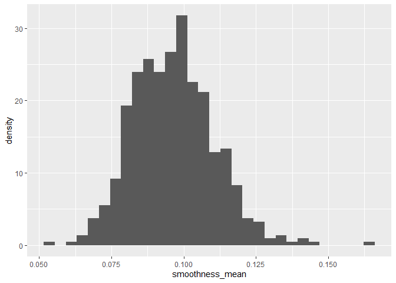<!-- -->

This is useful because it shows that the smoothness_mean variable
follows a normal distribution with 0.100 being the most common value for
this variable.

### Boxplots

The following code is used to create a boxplot of the mean area of
malignant and benign tumors.

``` r
ggplot(cancer_sample, aes(diagnosis, area_mean, colour = diagnosis)) + geom_boxplot(width = 0.2)
```

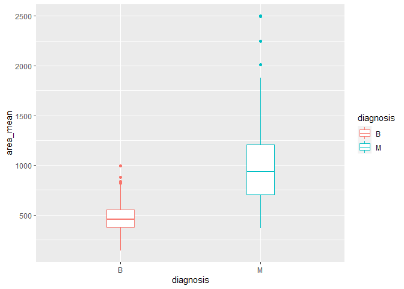<!-- -->

The following code is used to create a boxplot of the mean concavity of
malignant and benign tumors.

``` r
ggplot(cancer_sample, aes(diagnosis, concavity_mean, colour = diagnosis)) + geom_boxplot(width = 0.2)
```

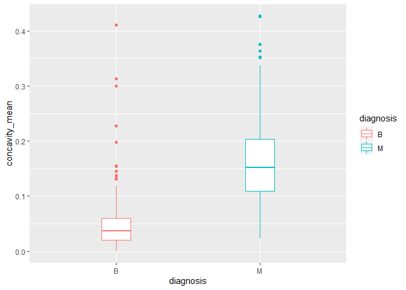<!-- -->

Boxplots are useful because they allow you to compare the values of a
continuous variable between categorical variables. Boxplots allow for
visualization of the minimum value, first quartile, median, third
quartile, and maximum value. You can also see if any outliers are
present. This dataset has one categorical variable and it is useful to
visualize how a numeric variable differs based on tumor type.

### Geom_point

The following code is used to create a scatterplot to explore the
relationship between the two continuous variables compactness_mean and
concavity_mean for both benign and malignant tumors.

``` r
ggplot(cancer_sample, aes(x=compactness_mean, y=concavity_mean)) + 
  geom_point(aes(colour = diagnosis),
              size = 3,
              alpha = 0.8)
```

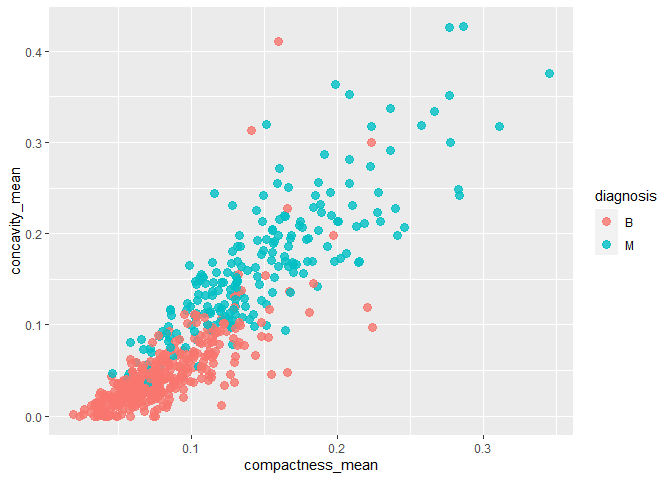<!-- -->

This is useful because this dataset contains several continuous
variables so it is beneficial to observe the relationships between them
and if the relationship is the same or different for malignant and
benign tumors.

### Density Plot

The following code is used to create a density plot of texture_worst for
both benign and malignant tumors.

``` r
ggplot(cancer_sample, aes(x = texture_worst)) + 
  geom_density(aes(group=diagnosis, colour=diagnosis))
```

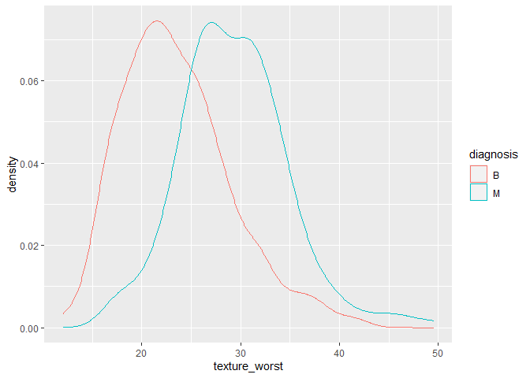<!-- -->

This density plot is useful because it displays that majority of the
values for texture_worst are at approximately 27 for malignant tumors
and 21 for benign tumors.

<!----------------------------------------------------------------------------->

# Task 3: Write your research questions (5 points)

So far, you have chosen a dataset and gotten familiar with it through
exploring the data. Now it’s time to figure out 4 research questions
that you would like to answer with your data! Write the 4 questions and
any additional comments at the end of this deliverable. These questions
are not necessarily set in stone - TAs will review them and give you
feedback; therefore, you may choose to pursue them as they are for the
rest of the project, or make modifications!

<!--- *****START HERE***** --->

1.  How many individuals with a benign tumor diagnosis have a
    symmetry_mean value less than 0.15?

2.  What proportion of individuals with a malignant tumor diagnosis have
    an area_mean greater than 1200?

3.  Are the values for area_worst greater among individuals with B or M
    diagnosis and by how much?

4.  Is the relationship between concave_points_mean and concavity_mean
    the same between B and M diagnosis and what is the relationship?

# Task 4: Process and summarize your data (13 points)

From Task 2, you should have an idea of the basic structure of your
dataset (e.g. number of rows and columns, class types, etc.). Here, we
will start investigating your data more in-depth using various data
manipulation functions.

### 1.1 (10 points)

Now, for each of your four research questions, choose one task from
options 1-4 (summarizing), and one other task from 4-8 (graphing). You
should have 2 tasks done for each research question (8 total). Make sure
it makes sense to do them! (e.g. don’t use a numerical variables for a
task that needs a categorical variable.). Comment on why each task helps
(or doesn’t!) answer the corresponding research question.

Ensure that the output of each operation is printed!

**Summarizing:**

1.  Compute the *range*, *mean*, and *two other summary statistics* of
    **one numerical variable** across the groups of **one categorical
    variable** from your data.
2.  Compute the number of observations for at least one of your
    categorical variables. Do not use the function `table()`!
3.  Create a categorical variable with 3 or more groups from an existing
    numerical variable. You can use this new variable in the other
    tasks! *An example: age in years into “child, teen, adult, senior”.*
4.  Based on two categorical variables, calculate two summary statistics
    of your choosing.

**Graphing:**

5.  Create a graph out of summarized variables that has at least two
    geom layers.
6.  Create a graph of your choosing, make one of the axes logarithmic,
    and format the axes labels so that they are “pretty” or easier to
    read.
7.  Make a graph where it makes sense to customize the alpha
    transparency.
8.  Create 3 histograms out of summarized variables, with each histogram
    having different sized bins. Pick the “best” one and explain why it
    is the best.

Make sure it’s clear what research question you are doing each operation
for!

<!------------------------- Start your work below ----------------------------->

### Question 1

1.  How many individuals with a benign tumor diagnosis have a
    symmetry_mean value less than 0.15?

The following code is used to compute the number of observations for the
categorical variable diagnosis.

``` r
count(cancer_sample, diagnosis, wt = NULL, sort = FALSE, name = NULL)
```

    ## # A tibble: 2 x 2
    ##   diagnosis     n
    ##   <chr>     <int>
    ## 1 B           357
    ## 2 M           212

Three histograms of the symmetry_mean variable for benign tumors are
displayed with different sized bins.

``` r
benign <- filter(cancer_sample, diagnosis == "B")
ggplot(benign, aes(symmetry_mean, ..density..)) +
  geom_histogram(bins = 30)
```

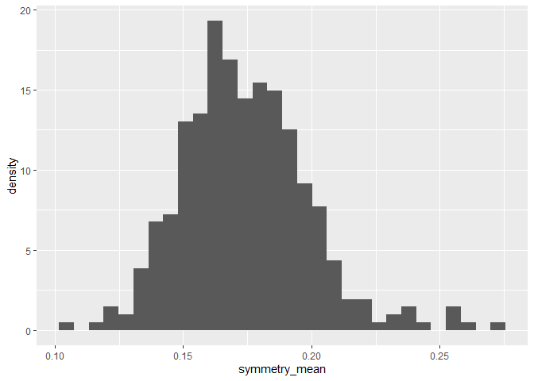<!-- -->

``` r
ggplot(benign, aes(symmetry_mean, ..density..)) +
  geom_histogram(bins = 50)
```

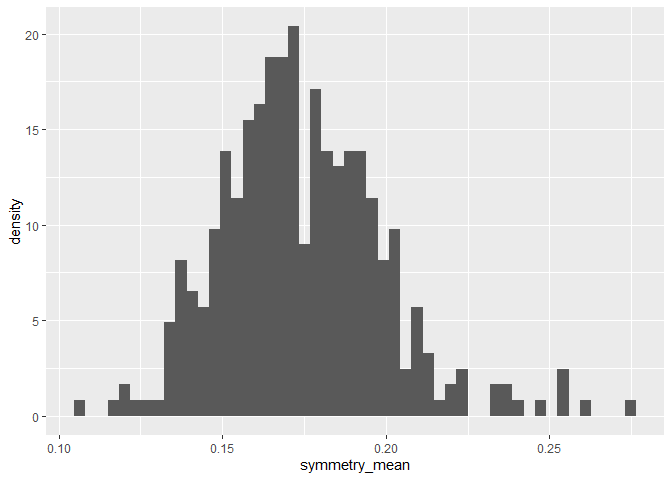<!-- -->

``` r
ggplot(benign, aes(symmetry_mean, ..density..)) +
  geom_histogram(bins = 10)
```

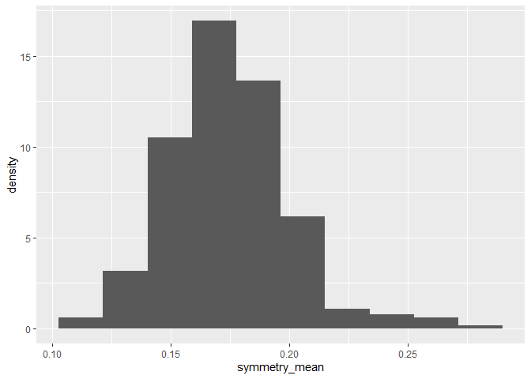<!-- -->

The second histogram with 50 sized bins is preferred because it best
displays how the distribution changes at each symmetry_mean value.

### Question 2

2.  What proportion of individuals with a malignant tumor diagnosis have
    an area_mean greater than 1200?

The following table of only metrics for malignant tumors displays am
additional column called “area_mean_category” which is a categorical
variable made from the area_mean numeric variable. Small indicates an
area less than 800, medium indicates an area between 800 and 1200, and
large indicates an area greater than 1200.

``` r
malignant <- filter(cancer_sample, diagnosis == "M")
malignant %>% summarise(area_mean = range(area_mean, na.rm = TRUE))
```

    ## # A tibble: 2 x 1
    ##   area_mean
    ##       <dbl>
    ## 1      362.
    ## 2     2501

``` r
malignant %>% mutate(area_mean_category=cut(area_mean, breaks=c(361.6, 800, 1200, 2501.0), labels=c("small", "medium", "large")))
```

    ## # A tibble: 212 x 33
    ##          ID diagnosis radius_m~1 textu~2 perim~3 area_~4 smoot~5 compa~6 conca~7
    ##       <dbl> <chr>          <dbl>   <dbl>   <dbl>   <dbl>   <dbl>   <dbl>   <dbl>
    ##  1   842302 M               18.0    10.4   123.    1001   0.118   0.278   0.300 
    ##  2   842517 M               20.6    17.8   133.    1326   0.0847  0.0786  0.0869
    ##  3 84300903 M               19.7    21.2   130     1203   0.110   0.160   0.197 
    ##  4 84348301 M               11.4    20.4    77.6    386.  0.142   0.284   0.241 
    ##  5 84358402 M               20.3    14.3   135.    1297   0.100   0.133   0.198 
    ##  6   843786 M               12.4    15.7    82.6    477.  0.128   0.17    0.158 
    ##  7   844359 M               18.2    20.0   120.    1040   0.0946  0.109   0.113 
    ##  8 84458202 M               13.7    20.8    90.2    578.  0.119   0.164   0.0937
    ##  9   844981 M               13      21.8    87.5    520.  0.127   0.193   0.186 
    ## 10 84501001 M               12.5    24.0    84.0    476.  0.119   0.240   0.227 
    ## # ... with 202 more rows, 24 more variables: concave_points_mean <dbl>,
    ## #   symmetry_mean <dbl>, fractal_dimension_mean <dbl>, radius_se <dbl>,
    ## #   texture_se <dbl>, perimeter_se <dbl>, area_se <dbl>, smoothness_se <dbl>,
    ## #   compactness_se <dbl>, concavity_se <dbl>, concave_points_se <dbl>,
    ## #   symmetry_se <dbl>, fractal_dimension_se <dbl>, radius_worst <dbl>,
    ## #   texture_worst <dbl>, perimeter_worst <dbl>, area_worst <dbl>,
    ## #   smoothness_worst <dbl>, compactness_worst <dbl>, concavity_worst <dbl>, ...

The following graph contains two geom layers and shows the distribution
of the mean area for malignant tumors.

``` r
ggplot(malignant, aes(x=area_mean)) +
  geom_histogram(aes(y=..density..),
                 colour = 1, fill = "blue") +
  geom_density()
```

    ## `stat_bin()` using `bins = 30`. Pick better value with `binwidth`.

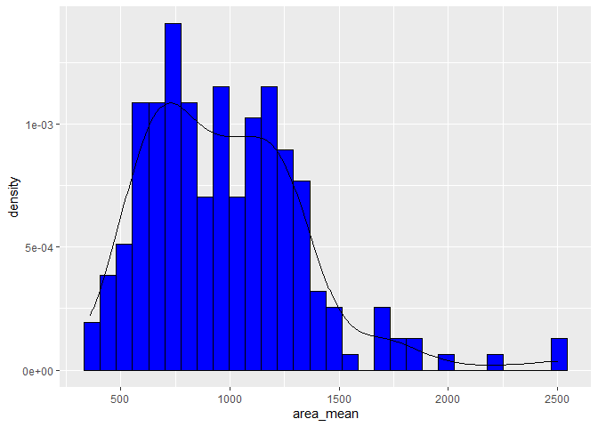<!-- -->

### Question 3

3.  Are the values for area_worst greater among individuals with a
    benign or malignant tumor diagnosis and by how much?

The following tables show the mean, range, median, and interquartile
range of worst area for both benign and malignant tumors.

``` r
cancer_sample %>% group_by(diagnosis) %>% summarise(area_worst = mean(area_worst, na.rm = TRUE))
```

    ## # A tibble: 2 x 2
    ##   diagnosis area_worst
    ##   <chr>          <dbl>
    ## 1 B               559.
    ## 2 M              1422.

``` r
cancer_sample %>% group_by(diagnosis) %>% summarise(area_worst = range(area_worst, na.rm = TRUE))
```

    ## `summarise()` has grouped output by 'diagnosis'. You can override using the
    ## `.groups` argument.

    ## # A tibble: 4 x 2
    ## # Groups:   diagnosis [2]
    ##   diagnosis area_worst
    ##   <chr>          <dbl>
    ## 1 B               185.
    ## 2 B              1210 
    ## 3 M               508.
    ## 4 M              4254

``` r
cancer_sample %>% group_by(diagnosis) %>% summarise(area_worst = median(area_worst, na.rm = TRUE))
```

    ## # A tibble: 2 x 2
    ##   diagnosis area_worst
    ##   <chr>          <dbl>
    ## 1 B               547.
    ## 2 M              1303

``` r
cancer_sample %>% group_by(diagnosis) %>% summarise(area_worst = IQR(area_worst, na.rm = TRUE))
```

    ## # A tibble: 2 x 2
    ##   diagnosis area_worst
    ##   <chr>          <dbl>
    ## 1 B               223.
    ## 2 M               742.

The following boxplot displays how worst area differs between benign and
malignant tumors. The y-axis displaying area_worst is logarithmic.

``` r
ggplot(cancer_sample, aes(diagnosis, area_worst, colour = diagnosis)) + geom_boxplot(width = 0.2) + scale_y_log10()
```

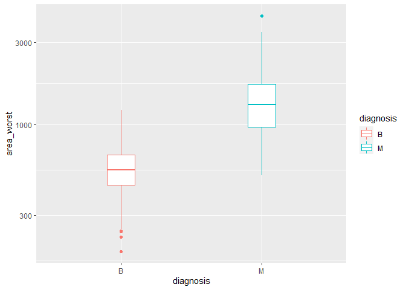<!-- -->

### Question 4

4.  Is the relationship between concave_points_mean and concavity_mean
    the same between B and M diagnosis and if so what is the
    relationship?

The following tables show the mean, range, median, and interquartile
range of mean concave points for both benign and malignant tumors.

``` r
cancer_sample %>% group_by(diagnosis) %>% summarise(concave_points_mean = mean(concave_points_mean, na.rm = TRUE))
```

    ## # A tibble: 2 x 2
    ##   diagnosis concave_points_mean
    ##   <chr>                   <dbl>
    ## 1 B                      0.0257
    ## 2 M                      0.0880

``` r
cancer_sample %>% group_by(diagnosis) %>% summarise(concave_points_mean = range(concave_points_mean, na.rm = TRUE))
```

    ## `summarise()` has grouped output by 'diagnosis'. You can override using the
    ## `.groups` argument.

    ## # A tibble: 4 x 2
    ## # Groups:   diagnosis [2]
    ##   diagnosis concave_points_mean
    ##   <chr>                   <dbl>
    ## 1 B                      0     
    ## 2 B                      0.0853
    ## 3 M                      0.0203
    ## 4 M                      0.201

``` r
cancer_sample %>% group_by(diagnosis) %>% summarise(concave_points_mean = median(concave_points_mean, na.rm = TRUE))
```

    ## # A tibble: 2 x 2
    ##   diagnosis concave_points_mean
    ##   <chr>                   <dbl>
    ## 1 B                      0.0234
    ## 2 M                      0.0863

``` r
cancer_sample %>% group_by(diagnosis) %>% summarise(concave_points_mean = IQR(concave_points_mean, na.rm = TRUE))
```

    ## # A tibble: 2 x 2
    ##   diagnosis concave_points_mean
    ##   <chr>                   <dbl>
    ## 1 B                      0.0175
    ## 2 M                      0.0386

Below displays a scatterplot of the relationship between
concave_points_mean on the x-axis and concavity_mean on the y-axis for
both benign (pink) and malignant (blue) tumors. The alpha transparency
has been changed to 0.2.

``` r
ggplot(cancer_sample, aes(x=concave_points_mean, y=concavity_mean)) + 
  geom_point(aes(colour = diagnosis),
              size = 3,
              alpha = 0.2)
```

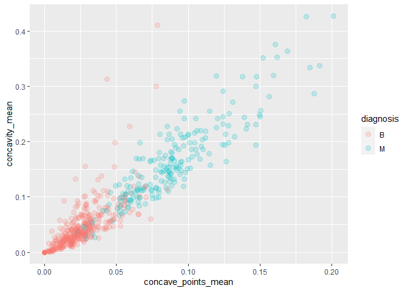<!-- -->
<!----------------------------------------------------------------------------->

### 1.2 (3 points)

Based on the operations that you’ve completed, how much closer are you
to answering your research questions? Think about what aspects of your
research questions remain unclear. Can your research questions be
refined, now that you’ve investigated your data a bit more? Which
research questions are yielding interesting results?

<!-------------------------- Start your work below ---------------------------->

**Question 1**

1.  How many individuals with a benign tumor diagnosis have a
    symmetry_mean value less than 0.15?

-   Computting the number of observations for the diagnosis variable
    allowed me to determine that there are 357 individals with benign
    tumors but this does not tell me anything about the symmetry_mean
    variable.

-   Creating three histograms with different sized bins allowed me to
    visualize the symmetry_mean distribution for benign tumors. This
    allows me to estimate the number of benign tumors with a
    symmetry_mean value of less than 0.15.

**Question 2**

2.  What proportion of individuals with a malignant tumor diagnosis have
    an area_mean greater than 1200?

-   Filtering the dataset to malignant tumors and categorizing the
    numeric area_mean variable was very useful because I can count the
    number of “Large” tumors in the area_mean_category column since
    these are tumors with a mean area greater than 1200.

-   The graph with two geom layers allowed me to visualize how many
    malignant tumors have an area greater than 1200 but since the y-axis
    displays density I cannot estimate the number of malignant tumors
    with an area greater than 1200.

**Question 3**

3.  Are the values for area_worst greater among individuals with a
    benign or malignant tumor diagnosis and by how much?

-   Computing the mean, range, median, and interquartile range of
    area_worst for both malignant and benign tumors was useful because
    the range allowed me to determine malignant tumors have greater
    maximum area_worst value compared to benign tumors.

-   Creating a boxplot of worst area of malignant and benign tumors
    allowed me to visualize that malignant tumors generally have a
    greater worst area compared to benign tumors but there is some
    overlap. I still don’t know how much greater the area_worst values
    are for malignant tumors.

**Question 4**

4.  Is the relationship between concave_points_mean and concavity_mean
    the same between benign and malignant tumors and what is the
    relationship?

-   Computing the mean, range, median, and interquartile range of
    concave_points_mean for both malignant and benign tumors not very
    useful for understanding the relationship between
    concave_points_mean and concavity_mean.

-   Creating a scatterplot of the relationship between
    concave_points_mean and concavity_mean for malignant and benign
    tumors was useful because there appears to be a linear relationship
    for both malignant and benign tumors. There are more outliers for
    benign tumors however.

<!----------------------------------------------------------------------------->

### Attribution

Thanks to Icíar Fernández Boyano for mostly putting this together, and
Vincenzo Coia for launching.
